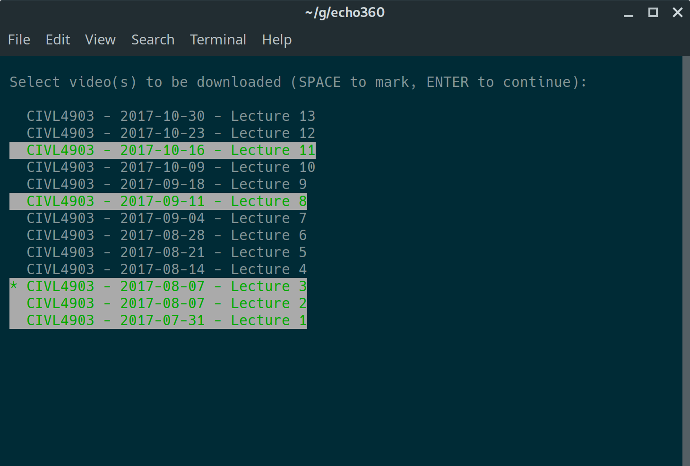

# Echo360 Videos Downloader

echo360 is a command-line Python tool that allows you to download lecture videos from any university's Echo360 lecture portal. All that's required is the particular course's url. See the FAQ for tips on how to find it.

The way this script works _should_ support all university's echo360 system in theory, see FAQ for details.

See it in action:

<p align="center">
    
</p>

# Getting Started

### Automated Installation

**Linux / MacOS**

```shell
./run.sh COURSE_URL  # where COURSE_URL is your course url
```

**Windows**

```shell
run.bat COURSE_URL  # where COURSE_URL is your course url
```

The scripts will boostrap all installation and download all needed files on the fly.

### Optional

-   ffmpeg (for transcoding ts file to mp4 file) See [here](https://github.com/adaptlearning/adapt_authoring/wiki/Installing-FFmpeg) for a brief instructions of installing it in different OS.

## Manual

The provided script automated every operations, and install all dependency in a local python virtual environment. You can also use the system-wise python installation by manual installation. Get started by first install all requirements:

```shell
pip install -r requirements.txt  # or with: python -m pip install -r requirements.txt
```

Then run with:

```shell
python echo360.py
```

### Operating System

-   Linux
-   OS X
-   Windows

# Usage

**NOTE THAT** all the below command you can substitute `python echo360.py` with `./run.sh` (or `run.bat` if you are in windows)

### Quick Start

```shell
>>> python echo360.py                       \
    https://view.streaming.sydney.edu.au:8443/ess/portal/section/2018_S1C_INFO1001_ND
```

### Script args
```
>>> usage: echo360.py [-h] [--output OUTPUT_PATH]
              [--after-date AFTER_DATEYYYY-MM-DD)]
              [--before-date BEFORE_DATE(YYYY-MM-DD] [--unikey UNIKEY]
              [--password PASSWORD] [--download-phantomjs-binary]
              [--chrome] [--interactive] [--debug]
              ECHO360_URL

Download lectures from Echo360 portal.

positional arguments:
  ECHO360_URL           Full URL of the echo360 course page, or only the UUID
                        (which defaults to USYD). The URL of the course's
                        video lecture page, for example: http://recordings.eng
                        ineering.illinois.edu/ess/portal/section/115f3def-7371
                        -4e98-b72f-6efe53771b2a)

optional arguments:
  -h, --help            show this help message and exit
  --output OUTPUT_PATH, -o OUTPUT_PATH
                        Path to the desired output directory. The output
                        directory must exist. Otherwise the current directory
                        is used.
  --after-date AFTER_DATE(YYYY-MM-DD), -a AFTER_DATE(YYYY-MM-DD)
                        Only download lectures newer than AFTER_DATE
                        (inclusive). Note: this may be combined with --before-
                        date.
  --before-date BEFORE_DATE(YYYY-MM-DD), -b BEFORE_DATE(YYYY-MM-DD)
                        Only download lectures older than BEFORE_DATE
                        (inclusive). Note: this may be combined with --after-
                        date
  --unikey UNIKEY, -u UNIKEY
                        Your unikey for your University of Sydney elearning
                        account
  --password PASSWORD, -p PASSWORD
                        Your password for your University of Sydney elearning
                        account
  --setup-credentials   Open a chrome instance to expose an ability for user
                        to log into any website to obtain credentials needed
                        before proceeding. (implies using chrome-driver)
  --download-phantomjs-binary
                        Force the echo360.py script to download a local binary
                        file for phantomjs (will override system bin)
  --chrome              Use Chrome Driver instead of phantomjs webdriver. You
                        must have chromedriver installed in your PATH.
  --interactive, -i     Interactively pick the lectures you want, instead of
                        download all (default) or based on dates .
  --debug               Enable extensive logging.
```
# Examples

```shell
>>> python echo360.py                  \
    "041698d6-f43a-4b09-a39a-b90475a63530" \  # Note this default to USYD's echo360
    --output "~/Lectures"                     # Use full URL for other University
```

### Download all available lectures

```shell
>>> python echo360.py                  \
    "041698d6-f43a-4b09-a39a-b90475a63530" \
    --output "~/Lectures"
```

### Download all lectures on or before a date

```shell
>>> python echo360.py                  \
    "041698d6-f43a-4b09-a39a-b90475a63530" \
    --output "~/Lectures"                  \
    --before-date "2014-10-14"
```

### Download all lectures on or after a date

```shell
>>> python echo360.py                  \
    "041698d6-f43a-4b09-a39a-b90475a63530" \
    --output "~/Lectures"                  \
    --after-date "2014-10-14"
```

### Download all lectures in a given date range (inclusive)

```shell
>>> python echo360.py                  \
    "041698d6-f43a-4b09-a39a-b90475a63530" \
    --output "~/Lectures"                  \
    --after-date "2014-08-26"              \
    --before-date "2014-10-14"
```

### Use chrome driver (instead of phantomjs)

Note: sometime it works better than phantomjs in some system

```shell
>>> python echo360.py                  \
    "041698d6-f43a-4b09-a39a-b90475a63530" \
    --chrome
```

# FAQ

### Is my university supported?

This is first built for the echo system in the University of Sydney, and then validated in several other universities' echo system. In theory, as long as the url are in the format of:

```shell
https://$(hostname)/ess/portal/section/$(UUID)
```

... then it should be supported.

The variables `$(hostname)` and `$(UUID)` are what differentiate different University's echo360 system. If there is no credentials needed (ie no need to login before accessing the page), then 90% of the time it should works. If login is needed, some extra work might need to be put in before it works for your university. If that is the case, create an issue to let me know.

### How do I retrieve the Course URL for a course?

You should go to the main Echo360 Lecture page, which usually composed of all the lecturer recordings in a list format as shown below. It's the main page that lists all the recorded lectures and gives you the option to stream them or download them individually. This is important for downloading all the available videos from within the course.


You can usually find this link on your course's main webpage. If your course webpage only links directly to videos, then you should be able to navigate back **by clicking the title of your course name (top of page)**.

The URL for the University of Sydney - 2017 semester 2 of CIVL4903 looks like

    https://view.streaming.sydney.edu.au:8443/ess/portal/section/041698d6-f43a-4b09-a39a-b90475a63530

which you can verify is correct in the above screenshot. **This should be the full URL you enter into the script, for all other universities' echo system.**

The UUID (Unified Unique IDentifier) is the last element of the URL. So in the above example it's,

    041698d6-f43a-4b09-a39a-b90475a63530

### I'm not sure of how to run it?

First, you'd need to install [Python](https://www.python.org/downloads/) in your system. Then, you can follow the youtube tutorial videos to get an idea of how to use the module.

- For [Windows users](https://www.youtube.com/watch?v=Lv1wtjnCcwI) (and showcased how to retrieve actual echo360 course url)

<p align="center">
    <iframe width="500" height="315" src="https://www.youtube.com/embed/Lv1wtjnCcwI" frameborder="0" allow="autoplay; encrypted-media" allowfullscreen></iframe>
</p>

### My credentials does not work?

You can setup any credentials need with manually logging into websites, by running the script with:
```sh
./run.sh ECHO360_URL --setup-credential
```
This will open up a chrome instance that allows you to log into your website as you normally do. Afterwards, simply type 'continue' into your shell and press enter to continue to proceeds with the rest of the script.

### How do I download only individual video(s)?

You are in luck! It is now possible to pick a subset of videos to download from (instead of needing to download everything like before). Just pass the interactive argument like this:
```sh
./run.sh ECHO360_URL --interactive  # or ./run.sh ECHO360_URL -i
```
...and it shall presents an interactive screen for you to pick each individual video(s) that you want to download, like the screenshot as shown below.



### Technical details

The current script uses a web-driver to emulate as a web-browser in order to retrieve the original streaming link. There are current two options for the web-driver: PhantomJS and Chrome. It then uses a hls downloader to simultaneously download all the smaller parts of the videos, and combined into one. Transcoding into mp4 will be performed if ffmpeg is present in your system, and all files will be renamed into a nice format.

# Credits

Credits to [jhalstead85](https://github.com/jhalstead85/lecho360) for which this script is based upon.
This script has then been adopted to be usable for USYD echo360. It was then extended to work in canvas (which uses a human-readable name instead of UUID); and later automated the entire process and become usable for all other universities.
